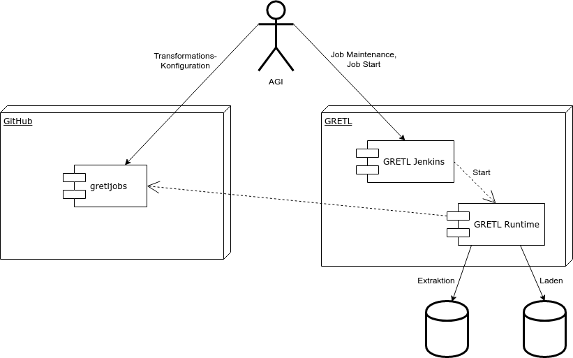
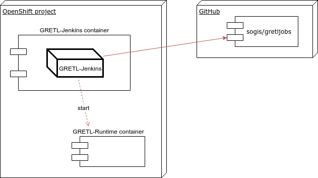

Einführung und Ziele
====================

Dieses Dokument ist nach [arc42](http://www.arc42.de/) Template Revision 7.0 strukturiert.

Diagramme werden online auf [draw.io](https://www.draw.io/) erstellt.
Die XML Definitionen der Diagramme liegen neben den exportierten Bildern.

Aufgabenstellung
----------------

### Was ist GRETL?
GRETL ist eine [Gradle](https://gradle.org/) Erweiterung zur Ausführung von GEO Daten Transformationen.

Der Name GRETL ist eine Kombination von **Gr**adle und [ETL](https://de.wikipedia.org/wiki/ETL-Prozess)

Qualitätsziele
--------------
* Standardisierter und automatisierter Build-Prozess.

Randbedingungen
===============

Organisatorische Randbedingungen
--------------------------------

### Veröffentlichung als Open Source
Die Lösung wird als Open Source verfügbar gemacht.

Lizenz: MIT

Kontextabgrenzung
=================

Fachlicher Kontext
------------------

* **AGI**: erstellt Jobs im *gretljobs* Repository auf *GitHub* und verwaltet deren Ausführung über den *GRETL Jenkins*.
* **GitHub**: webbasierter Online-Dienst für das Versionsverwaltungssystem Git: <https://github.com/>
* **gretljobs**: Transformations-Job Konfigurationen für die *GRETL Runtime*.
* **GRETL**: System für die Ausführung der GRETL Jobs.
* **GRETL Jenkins**: Verwaltungsoberfläche / UI für GRETL Jobs.
* **GRETL Runtime**: Runtime für GRETL Jobs.

### GRETL-Job Generierung (Seeder-Job)
Beim GRETL-Jenkins ist ein [Seeder-Job](https://github.com/sogis/openshift-jenkins/blob/master/configuration/jobs/administration/jobs/gretl-job-generator/config.xml)
vor konfiguriert, welcher die GRETL-Jobs generiert. Der Job verwendet die [Job DSL](https://wiki.jenkins.io/display/JENKINS/Job+DSL+Plugin).

Der GRETL-Jenkins bekommt die Konfiguration vom Seeder-Job über Umgebungsvariablen:
* **GRETL_JOB_REPO_URL**: git://github.com/sogis/gretljobs.git
* **GRETL_JOB_FILE_PATH**: **
* **GRETL_JOB_FILE_NAME**: gretl-job.groovy

Dies ist die produktive Konfiguration auf das gretljobs Repo.
Über alle Ordner hinweg werden Dateien mit dem Namen *gretl-job.groovy* gesucht.
Für jede gefundene Datei/Skript wird ein Job mit der Definition aus dem Skript ([Jenkins Pipeline](https://jenkins.io/doc/book/pipeline/)) erstellt.
Der Name vom Job ist der Name vom Ordner, wo das Skript gefunden wurde.

Technischer Kontext
-------------------

### &lt;Gradle&gt;
TODO

### &lt;Jenkins&gt;
TODO

Entwurfsentscheidungen
======================

Gradle als Job Runtime
----------------------

### Fragestellung
Wieso wird Gradle als Runtime eingesetzt?

### Entscheidung
TODO

GRETL als Gradle Plugin
-----------------------

### Fragestellung
Wieso wird die ETL Logik als Gradle Plugin geschrieben?

### Entscheidung
TODO

Jenkins als Benutzeroberfläche
------------------------------

### Fragestellung
Warum ist Jenkins das UI?

### Entscheidung
TODO

GRETL Job Ausführung auf Build-Container
----------------------------------------

### Fragestellung
Wieso wird für jede Job Ausführung ein eigener Container gestartet?

### Alternativen
1. Einzelner Server läuft und steht für Jobs zur Verfügung.
2. Jeder Job hat einen laufenden Container.

### Entscheidung
Es wird das Prinzip vom Build-Container eingesetzt.
Da das Scheduling von Jenkins übernommen wird, braucht es keine lang-laufenden Container.
Zum Ausnützen der Stärken von Container Plattformen werden kurz-lebige Container eingesetzt.
Dadurch sind sie unabhängig von einander und die Resourcen können besser genutzt werden.

GRETL Runtime als Jenkins Slave
-------------------------------

### Fragestellung
Wieso ist die GRETL Runtime als Jenkins Slave realisiert?

### Alternativen
1. Einzelner Server läuft immer und arbeitet Jobs bei Aufruf ab.

### Entscheidung
TODO

Qualitätsanforderungen
======================

Qualitätsbaum
-------------

Qualitätsszenarien
------------------

Risiken und technische Schulden
===============================

Glossar
=======

| Begriff | Definition |
| --- | --- |
| *ETL* | [Extract, Transform, Load](https://de.wikipedia.org/wiki/ETL-Prozess) |
